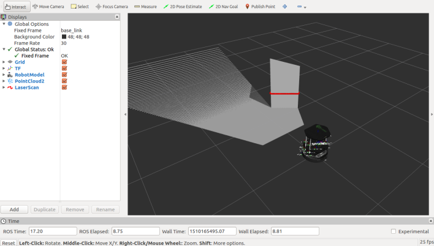

# Report of the practical class 2

## 1) Getting the robot to move

In order to make the robot move, we have to knwo different things before. Let's note the important datas :

- The topic we will send data to : `/cmd_vel_mux/input/navi`
- The type of the topic : `geometry_msgs/Twist`

If we didn't know the name of the topic, we could have used `rostopic list` in order to get the list of all topics that we can manipulate. And as for the type, we could have used the command `rostopic type <topic_name>` in order to get the type of the given topic.

This type of topic need a particular format of data which is the following : $'[x, y, z]'~~'[\alpha, \beta, \gamma]'$ with x, y and z representing respectively the linear velocity according to the x, y and z axis and $\alpha$, $\beta$ and $\gamma$ representing respectively the angular velocity around the x, y and z axis. 

**Example :**

Let's say that we want to send the following data to the topic `/cmd_vel_mux/input/navi` of type `geometry_msgs/Twist` :

$$\left\\{ \begin{array}{lll}x = 2.0\\\ y = 1.0\\\ z = 0.0\end{array}\right. \quad \left\\{ \begin{array}{lll}\alpha = 0.0\\\ \beta = 3.0\\\ \gamma = 0.0\end{array} \right.$$

Our command will be : `rostopic pub /cmd_vel_mux/input/navi geometry_msgs/Twist '[2.0, 1.0, 0.0]' '[0.0, 3.0, 0.0]'`

---

## 2) Program a keyboard-based teleoperation

let's again note every important information :

- The topic name : `/cmd_vel_mux/input/navi`
- The topic type : `geometry_msgs/Twist`
- The `u` key will be used to go forward
- The `j` key will be used to go backward
- The `h` key will be used to turn left
- The `k` key will be used to turn right
- The `f` key will be used to accelerate the robot of 10%
- The `s` key will be used to decelerate the robot of 10%

We've seen in the first practical class how to create a package to allow ROS to read a Python file.
We've done the same, the following commands recall all the steps to create a package :

1. Create a folder and a `src` folder inside it : `mdkir -p tp_student/src`
2. Enter the following command : `catkin_make`
3. Being inside the `tp_student` folder in the terminal, enable the virtual environment : `source devel/setup.sh`
4. Go to the `src` folder and enter the following command : `catkin_create_pkg tp2_ros_package`
5. A new folder is now created, go into this folder and make a new directory called `scripts`: `mkdir scripts`
6. Create a new Python file that will interact with ROS : `touch my_python_file.py`
7. Don't forget to give the authorizations to the file : `chmod +x my_python_file.py`
8. Launch the python file with the following command : `rosrun tp2_ros_package my_python_file.py`

Our python_file completed is in the repository so we won't explain the code in this file. 

## 3) Using ROS to launch files

By launching the command : `roslaunch tp1_ros_package example_launch_file.launch`, we notice that every files in the tp1 has been launched in the same terminal. We are able to listen to the message and seeing the log that the message has been sent on the same terminal which can be handful projects with a large amount of nodes.

After entering the command, we can check the list of all the topics (`rostopic list`) and we notice that the `/talking_topic` has been added to the list. This is another demonstration that all files has been launched. The `/talking_topic` will disappear once we kill the terminal.

### 3.1)

Going back to the tp2, we can also map the keys with the different actions inside the .launch file in to make things more clear.
The structure of the code is fairly the same, we will only use a new methods : `rospy.get_param()` in order to get the parameters we've defined in the .launch file.

The .launch file is also in the repository and we have made 2 differents files to differentiate the Python file with all the parameters directly inside the Python file (`teleoperation_node.py`) and the file where parameters are defined in the .launch file (`teleoperation_node_v2.py`).

## 4) Exploring TurtleBot2 sensors

### 4.1) Detailed informations about messages types `rosmsg`

`rosmsg` provides a detailed description of the type of the message we have. We will take an example and show what kind of informations we can get from this command.

Frist of all, we need to choose a topic. We want now to know more about the sensors so we will enter the command `rostopic list` and then we will choose the the topic named `/mobile_base/sensors/imu_data`

Now that we have the name of the topic, we want its type, so we enter the following command : `rostopic type /mobile_base/sensors/imu_data`. It prints `sensor_msgs/Imu`.

Lastly, all we need to do now is to enter the command `rosmsg show -r sensor_msgs/Imu` to get detailed information about this type of message, here's what we got :

~~~
# This is a message to hold data from an IMU (Inertial Measurement Unit)
#
# Accelerations should be in m/s^2 (not in g's), and rotational velocity should be in rad/sec
#
# If the covariance of the measurement is known, it should be filled in (if all you know is the 
# variance of each measurement, e.g. from the datasheet, just put those along the diagonal)
# A covariance matrix of all zeros will be interpreted as "covariance unknown", and to use the
# data a covariance will have to be assumed or gotten from some other source
#
# If you have no estimate for one of the data elements (e.g. your IMU doesn't produce an orientation 
# estimate), please set element 0 of the associated covariance matrix to -1
# If you are interpreting this message, please check for a value of -1 in the first element of each 
# covariance matrix, and disregard the associated estimate.

Header header

geometry_msgs/Quaternion orientation
float64[9] orientation_covariance # Row major about x, y, z axes

geometry_msgs/Vector3 angular_velocity
float64[9] angular_velocity_covariance # Row major about x, y, z axes

geometry_msgs/Vector3 linear_acceleration
float64[9] linear_acceleration_covariance # Row major x, y z
~~~

### 4.2) Visualization of the sensor readings `rviz`

We have downloaded a rviz config file that we will name `tp-2.rviz` from now on.

To visualize the data of the sensors, we will use the following command : `rosrun rviz rviz -d tp-2.rviz`

This is what we have after entering the last command. 

We will then add the following Displays :

- RGB Image
- Depth Image
- IMU data

That adds some windows as it can be seen in the following image. We will talk about every new Displays :

The `RGB Image` display is the one in the left side at the middle. It gives us a representation of the colorized Image the robot sees

The `Depth Image`display is below, in the left-down corner. Estimate the depth of the image and shows it in balck and white with white being the furthest and black the nearest. The shade created by the image allows us to easily see the depths. Note that, compared to the `RGB Image` display, the image given is a bit zoomed.

The `IMU data` Display gives us data on the Inertia of the robot. It is characterized by the infinite purple cylinder that surround the robot. 

